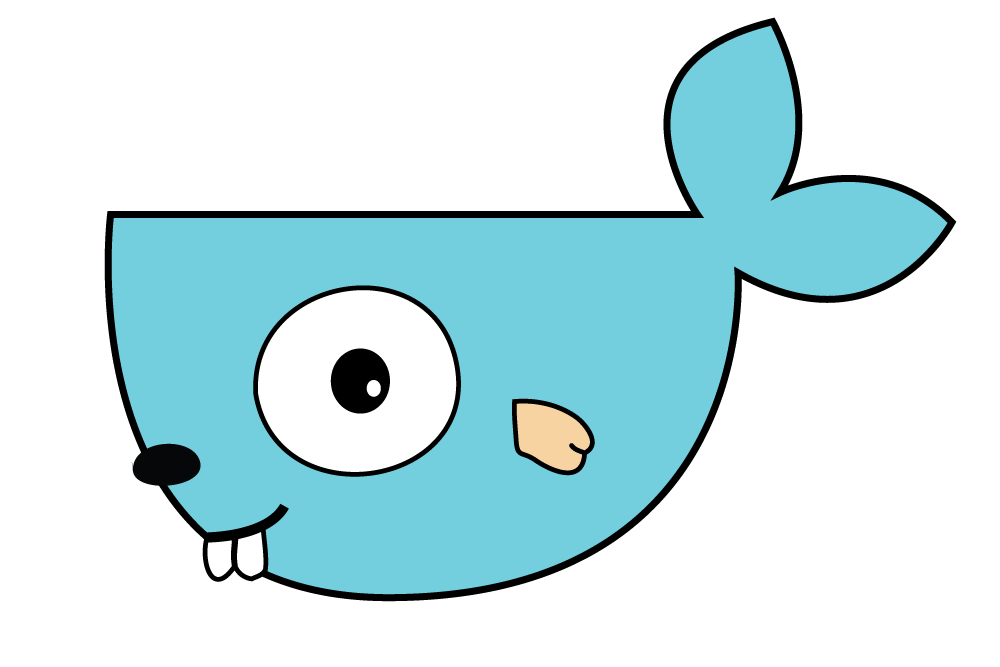

gockerize
=========

Build static golang binaries and package them into minimal docker containers

License
-------

BSD 3-Clause, see accompanying LICENSE file.

Requirements
------------

  - bash
  - docker 1.5+

Usage
-----

    gockerize <image> <package> [<source> [<mapping> [<Dockerfile>]]]

The default use case is to call the script from the root directory of
the package being built, with any dependencies vendored in and the
Dockerfile at the root of the package.

#### Arguments

The `image` argument determines the name of the resulting Docker image.

The `package` argument is the fully qualified name of the package being
built.

The `source` argument can be used to easily include non-vendored dependencies
into the build context. For instance, given the following hierarchy:

    src/
        acme.com/
            common/
            foo/

Where `foo` is the service to be built and `common` is a package it depends on.

The following command can be used, from `src/acme.com/foo` :

    gockerize foo acme.com/foo ..

This will result in all of `src/acme.com` being used as build context, under
`$GOPATH/src/acme.com`.

Similarly, `mapping` can be changed from its default value to accommodate
source layouts that deviate from golang's conventions and `Dockerfile` can
point to a Dockerfile at a non-default location, including outside of the
Docker build context.

The contents of the `GOARGS` environment variable are passed to the go build
command inside the container. Among other things, this makes it easy to use
custom build tags.

#### Dockerfile

A typical Dockerfile may look like:

    FROM scratch
    ADD bin/foo /foo
    EXPOSE 12345
    ENTRYPOINT [ "/foo" ]

The Docker image is built within a temporary container and its build
context is limited to the content of `GOPATH` on that container, hence
the reference to `bin/foo` which is the location of the binary produced
by compiling package `acme.com/foo`.

Dependency resolution
---------------------

For ease of use, gockerize uses `go get` to automatically fetch remote
dependencies from github and other public repositories supported by default,
however, vendored dependencies should be preferred as they ensure repeatable
build.

gockerize uses Go 1.5.3 and enables [GOVENDOREXPERIMENT](https://docs.google.com/document/d/1Bz5-UB7g2uPBdOx-rw5t9MxJwkfpx90cqG9AFL0JAYo).

Patching standard lib
---------------------

Fully static builds allow easy patching of the standard library. gockerize
leverages that by automatically applying patches found in the `patches` subdir
of the package being built.

Care should be taken that the patches cleanly apply against the version of Go
used in the container (1.5.3 at this time).

